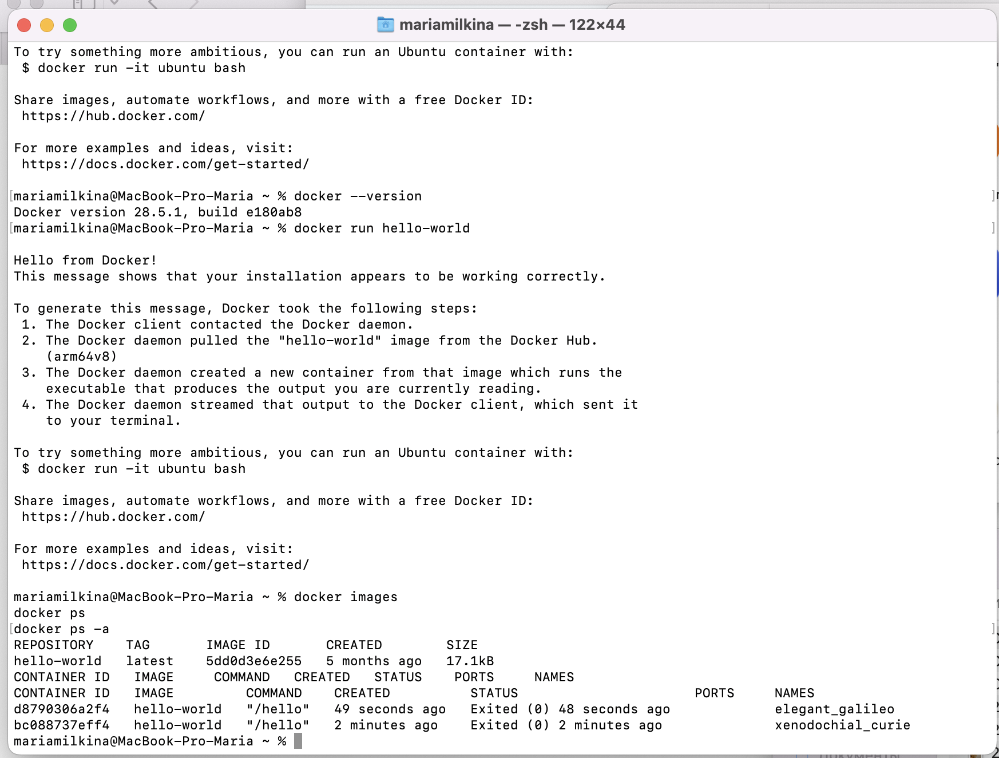
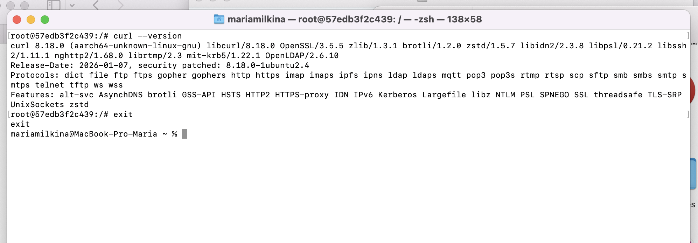
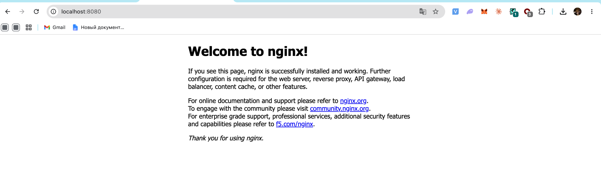
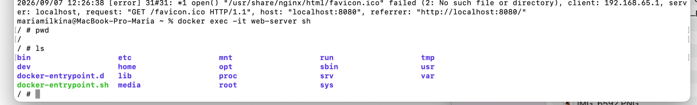
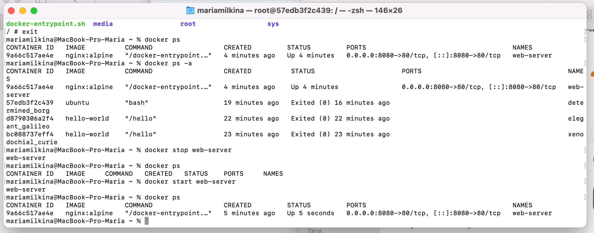
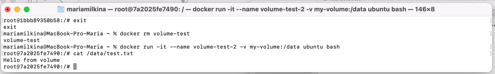
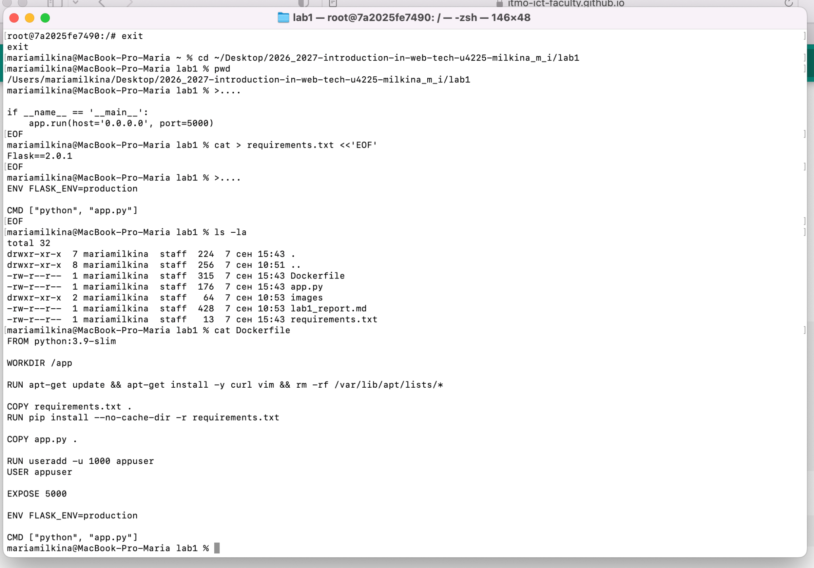
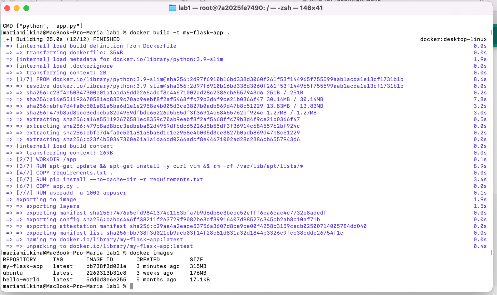
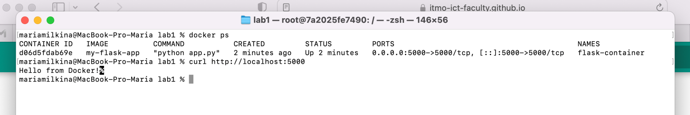

University: [ITMO University](https://itmo.ru/ru/)  
Faculty: [FICT](https://fict.itmo.ru)  
Course: [Введение в веб технологии](https://itmo-ict-faculty.github.io/introduction-in-web-tech/)  
Year: 2026/2027  
Group: U4225  
Author: Milkina Maria Igorevna  
Lab: Lab1  
Date of create: 07.09.2026  
Date of finished:  

**Лабораторная работа №1**

**Основы работы с Docker**

**Цель работы**

Разобраться с базовой работой Docker: образами, контейнерами, volumes и запуском приложений внутри контейнера.

**Ход работы**

### 1. Проверка Docker

Сначала проверила установленную версию Docker и запустила тестовый контейнер `hello-world`.

```bash
docker --version
docker run hello-world
docker images
docker ps
docker ps -a
```

Docker успешно запустился и вывел сообщение `Hello from Docker!`.



### 2. Работа с Ubuntu

Загрузила готовый образ Ubuntu и запустила его в интерактивном режиме.

```bash
docker pull ubuntu:latest
docker run -it ubuntu bash
```

Внутри контейнера установила `curl` и проверила его версию.

```bash
apt update && apt install -y curl
curl --version
```



### 3. Запуск nginx

Запустила контейнер nginx и пробросила порт `8080` на порт `80` контейнера.

```bash
docker run -d -p 8080:80 --name web-server nginx:alpine
docker ps
```

После перехода на `http://localhost:8080` открылась стандартная страница nginx.



Далее посмотрела логи контейнера и подключилась внутрь него.

```bash
docker logs web-server
docker exec -it web-server sh
pwd
ls
```



### 4. Управление контейнерами

Проверила остановку и повторный запуск контейнера.

```bash
docker ps
docker ps -a
docker stop web-server
docker ps
docker start web-server
docker ps
```

После остановки контейнер исчез из списка запущенных, а после `docker start` снова появился со статусом `Up`.



После проверки контейнер и образ nginx были удалены.

```bash
docker stop web-server
docker rm web-server
docker rmi nginx:alpine
```

### 5. Работа с volumes

Создала Docker volume:

```bash
docker volume create my-volume
```

Подключила его к Ubuntu-контейнеру и записала в него файл.

```bash
docker run -it --name volume-test -v my-volume:/data ubuntu bash
echo "Hello from volume" > /data/test.txt
cat /data/test.txt
```

После этого первый контейнер был удалён и создан новый с тем же volume.

```bash
docker rm volume-test
docker run -it --name volume-test-2 -v my-volume:/data ubuntu bash
cat /data/test.txt
```

Файл сохранился и в новом контейнере, то есть данные volume не удалились вместе с первым контейнером.



**Лабораторная работа со звёздочкой**

Дополнительно сделала небольшое Flask-приложение и собрала для него собственный Docker-образ.

Были созданы файлы `app.py`, `requirements.txt` и `Dockerfile`.



Образ собрала командой:

```bash
docker build -t my-flask-app .
```

После сборки `my-flask-app` появился в списке локальных образов.

```bash
docker images
```



При первом запуске появилась ошибка совместимости Flask и Werkzeug. Для исправления в `requirements.txt` была добавлена совместимая версия Werkzeug:

```text
Flask==2.0.1
Werkzeug==2.0.3
```

После пересборки контейнер успешно запустился.

```bash
docker run -d -p 5000:5000 --name flask-container my-flask-app
docker ps
curl http://localhost:5000
```

В ответ приложение вернуло:

```text
Hello from Docker!
```



**Результат**

В ходе работы я попробовала основные команды Docker, работу с готовыми образами, запуск и управление контейнерами, nginx и Docker volumes.

Дополнительно собрала собственный Docker-образ и запустила Flask-приложение внутри контейнера.

**Вывод**

Разобралась с базовой логикой Docker и на практике посмотрела, как создаются и запускаются контейнеры, как сохраняются данные через volumes и как приложение можно упаковать в собственный Docker-образ.
