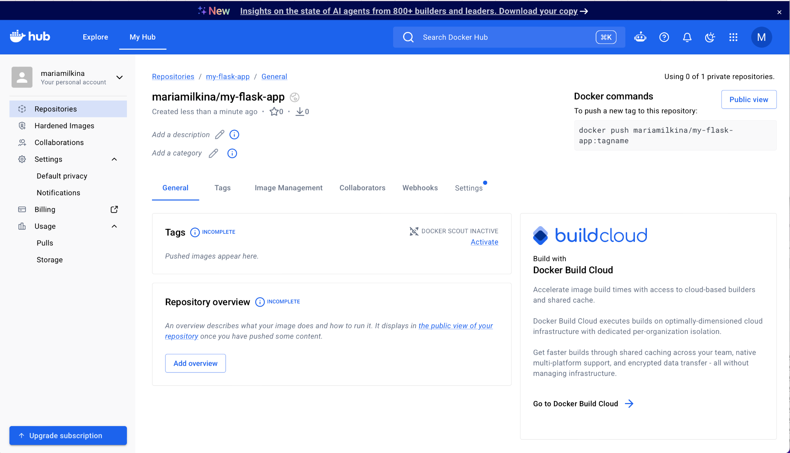
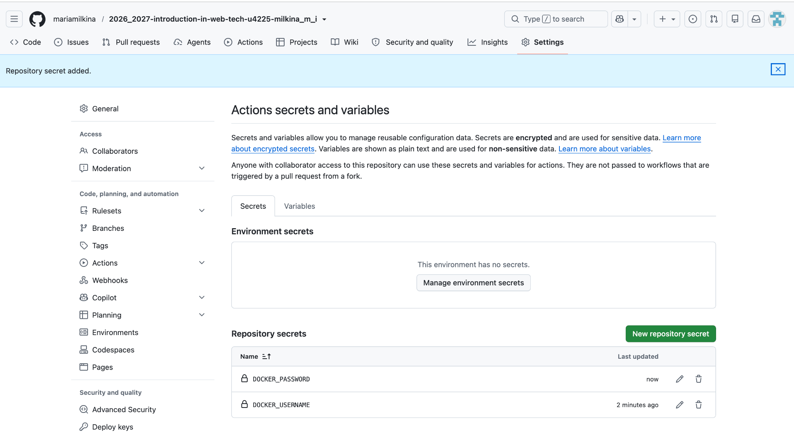
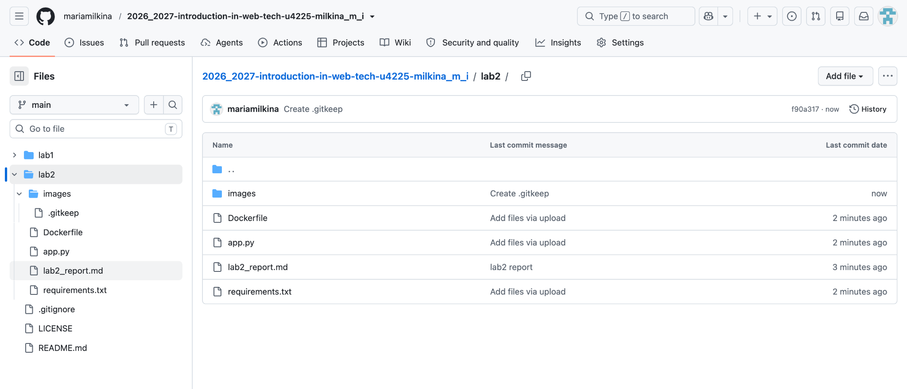
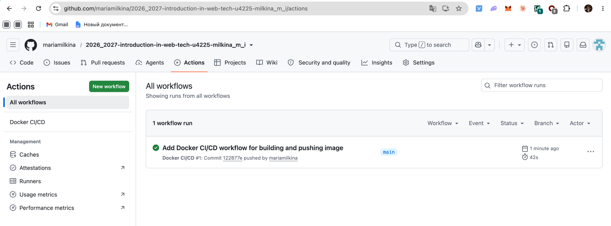
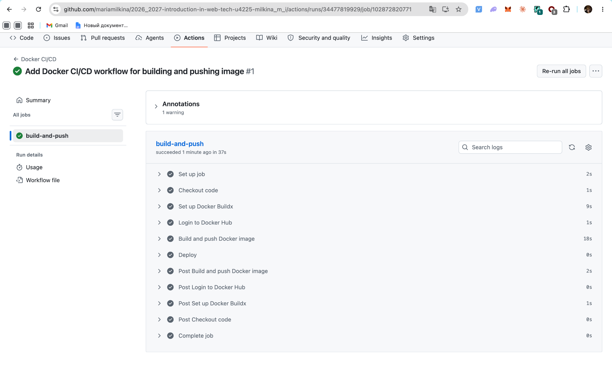
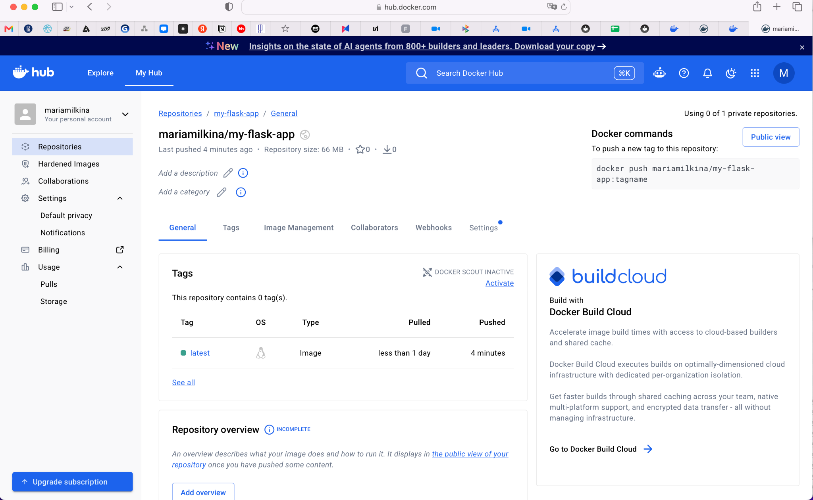
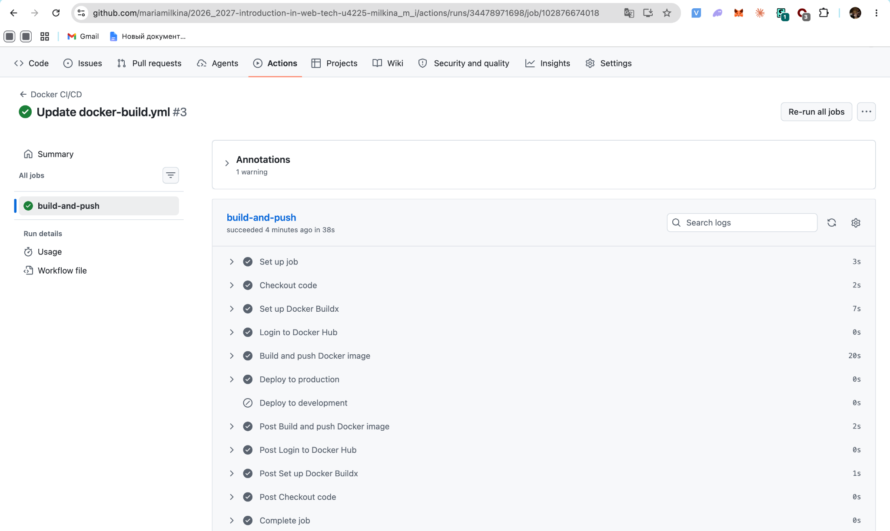
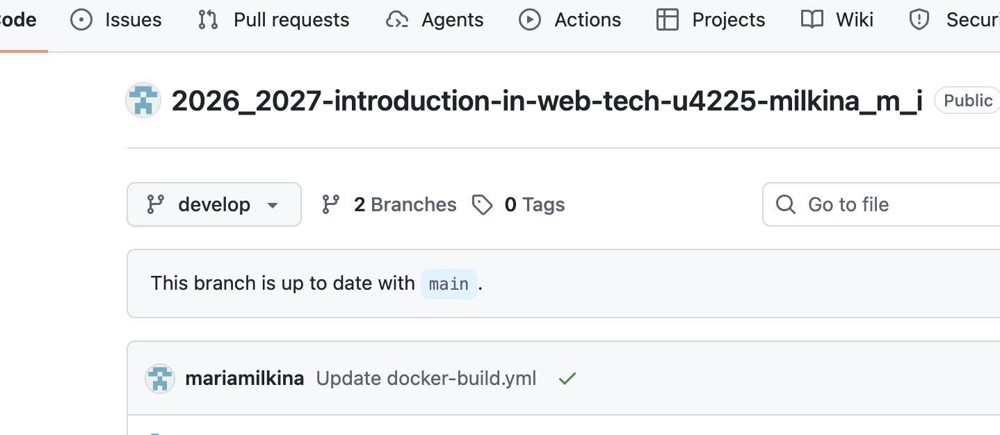
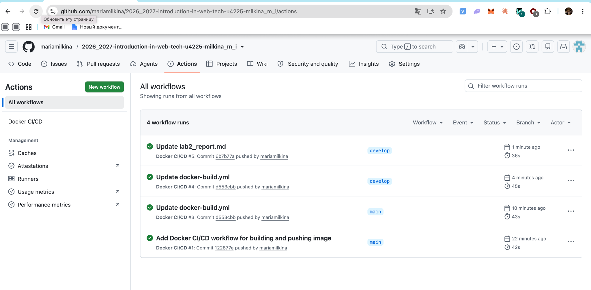
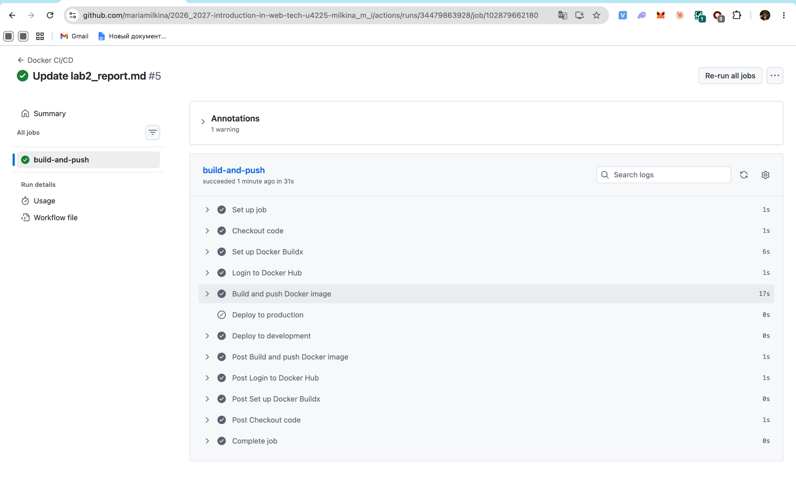

University: [ITMO University](https://itmo.ru/ru/)<br>
Faculty: [FICT](https://fict.itmo.ru)<br>
Course: [Введение в веб технологии](https://itmo-ict-faculty.github.io/introduction-in-web-tech/)<br>
Year: 2026/2027<br>
Group: U4225<br>
Author: Milkina Maria Igorevna<br>
Lab: Lab2<br>
Date of create: 10.09.2026<br>
Date of finished:

**Лабораторная работа №2**

**CI/CD для Docker приложения**

**Цель работы**

Настроить CI/CD-пайплайн с помощью GitHub Actions для автоматической сборки и публикации Docker-образа в Docker Hub. Дополнительно настроить различное поведение пайплайна для веток `main` и `develop`.

**Ход работы**

**1. Подготовка Docker Hub**

Для публикации Docker-образа был создан публичный репозиторий `mariamilkina/my-flask-app` в Docker Hub.



**2. Настройка секретов GitHub**

Для авторизации GitHub Actions в Docker Hub в настройках GitHub-репозитория были добавлены Repository secrets:

- `DOCKER_USERNAME` — имя пользователя Docker Hub;
- `DOCKER_PASSWORD` — Personal Access Token Docker Hub с правами Read & Write.

Значения секретов хранятся в скрытом виде.



**3. Подготовка проекта**

В папку `lab2` были добавлены файлы приложения из первой лабораторной работы:

- `Dockerfile`;
- `app.py`;
- `requirements.txt`.

Также были созданы файл отчёта `lab2_report.md` и папка `images` для скриншотов.



**4. Настройка GitHub Actions**

В корне репозитория был создан файл:

`.github/workflows/docker-build.yml`

Workflow запускается при push в репозиторий и выполняет следующие действия:

- checkout исходного кода;
- настройку Docker Buildx;
- авторизацию в Docker Hub;
- сборку Docker-образа;
- публикацию образа в Docker Hub;
- выполнение этапа deploy.

Для сборки использовались файлы из папки `lab2`, а итоговый образ публиковался с именем:

`mariamilkina/my-flask-app:latest`

После добавления workflow пайплайн успешно запустился в GitHub Actions.



Внутри job `build-and-push` успешно выполнились этапы checkout, настройки Buildx, авторизации, сборки и публикации образа.



**5. Проверка публикации образа**

После завершения пайплайна в Docker Hub появился Docker-образ с тегом `latest`.



Таким образом, сборка и публикация Docker-образа выполняются автоматически при изменениях в репозитории.

**Лабораторная работа со звёздочкой**

Для дополнительной части была настроена работа CI/CD-пайплайна с двумя ветками: `main` и `develop`.

Workflow запускается для обеих веток:

```yaml
on:
  push:
    branches: [main, develop]
```

**6. Deploy для ветки main**

Для основной ветки был добавлен отдельный этап deploy:

```yaml
- name: Deploy to production
  if: github.ref == 'refs/heads/main'
  run: echo "Deploying to production server..."
```

При запуске workflow из ветки `main` этап `Deploy to production` выполняется, а этап `Deploy to development` пропускается.



**7. Создание ветки develop**

Для разработки была создана отдельная ветка `develop` на основе `main`.



После настройки workflow GitHub Actions успешно запускается как для `main`, так и для `develop`.



**8. Deploy для ветки develop**

Для ветки разработки был добавлен отдельный этап:

```yaml
- name: Deploy to development
  if: github.ref == 'refs/heads/develop'
  run: echo "Deploying to development server..."
```

Для проверки в ветке `develop` был выполнен commit. После этого GitHub Actions автоматически запустил пайплайн.

При запуске из `develop` этап `Deploy to production` был пропущен, а `Deploy to development` успешно выполнен.



**Результат**

В ходе лабораторной работы был настроен CI/CD-пайплайн с использованием GitHub Actions. При push в репозиторий Docker-образ автоматически собирается и публикуется в Docker Hub.

Дополнительно была создана ветка `develop` и настроен условный deploy в зависимости от ветки: для `main` выполняется deploy в production, а для `develop` — deploy в development.
