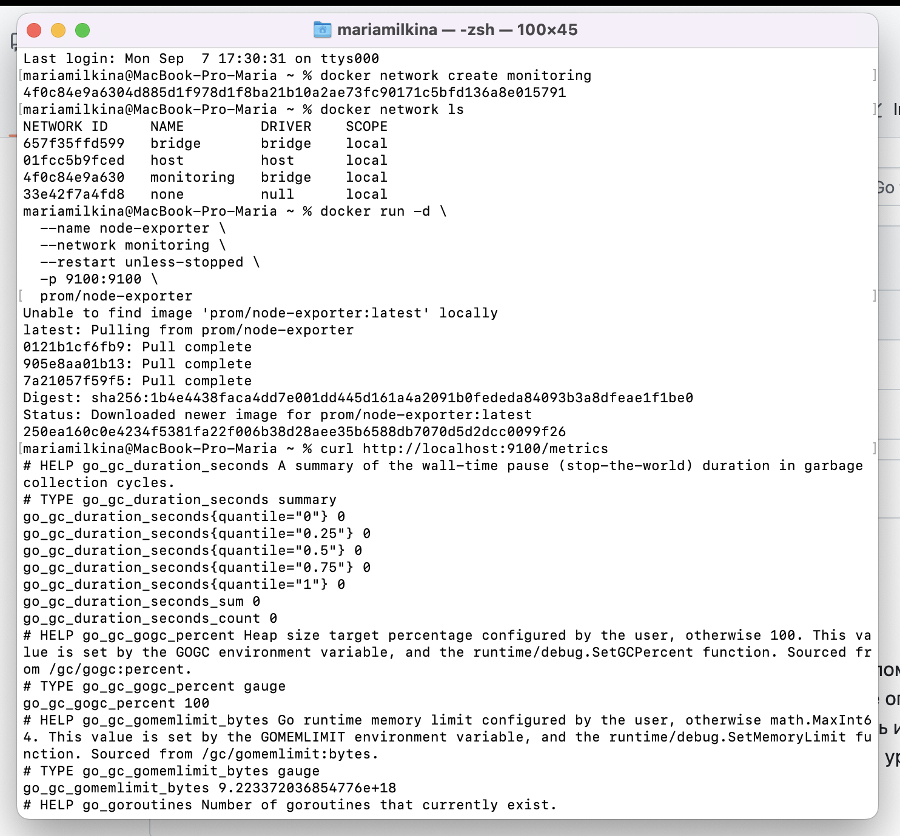
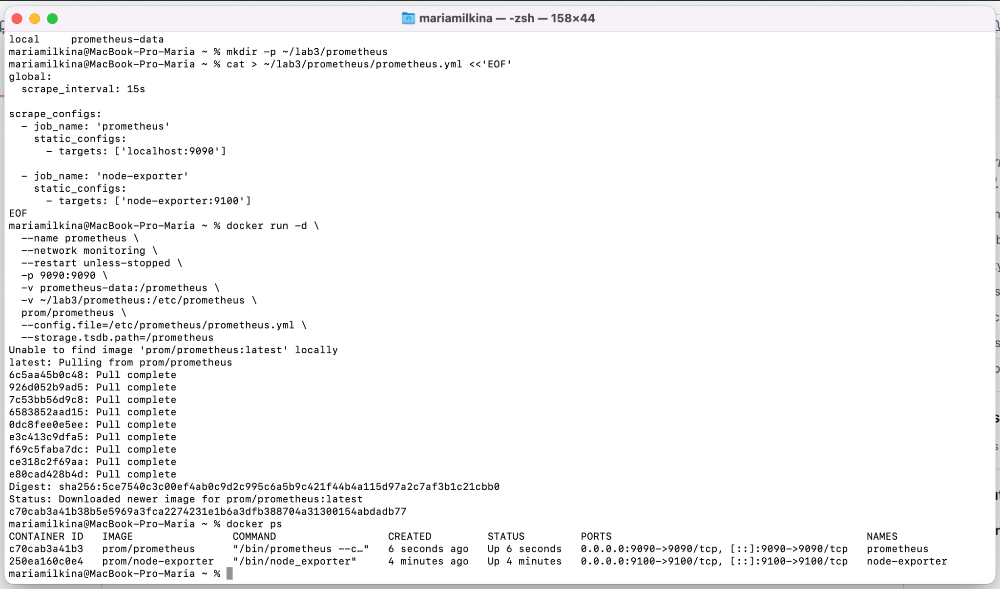
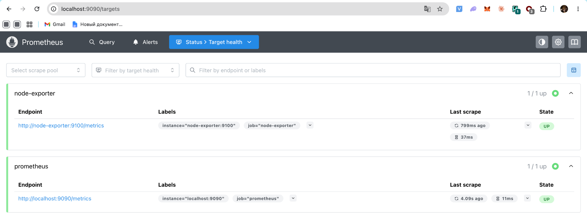
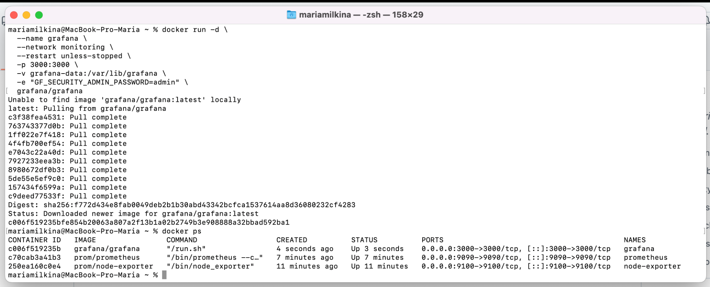
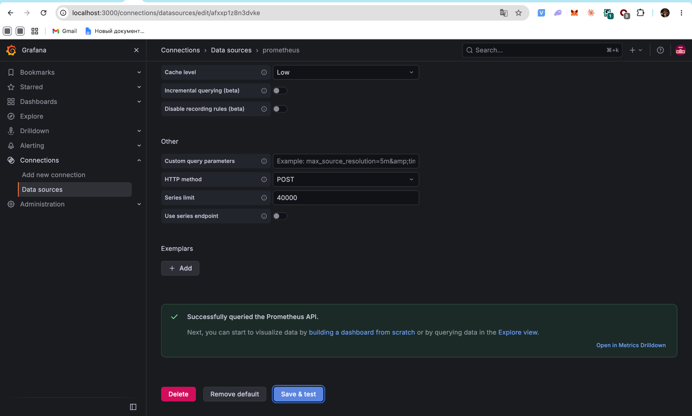
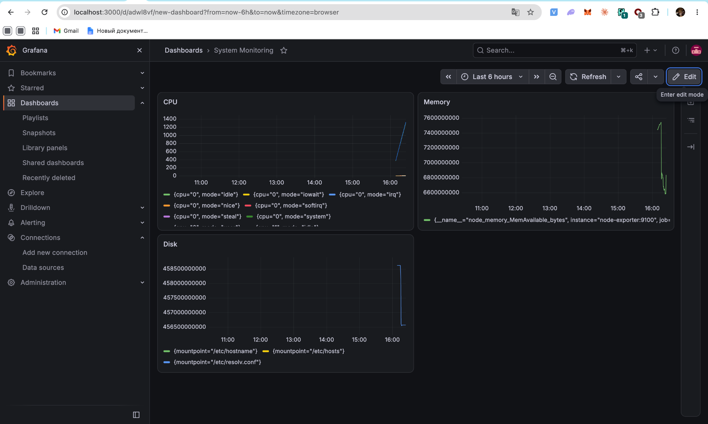

University: [ITMO University](https://itmo.ru/ru/)<br>
Faculty: [FICT](https://fict.itmo.ru)<br>
Course: [Введение в веб технологии](https://itmo-ict-faculty.github.io/introduction-in-web-tech/)<br>
Year: 2026/2027<br>
Group: U4225<br>
Author: Milkina Maria Igorevna<br>
Lab: Lab3<br>
Date of create: 11.09.2026<br>
Date of finished:

**Лабораторная работа №3**

**Мониторинг с Prometheus и Grafana**

**Цель работы**

Настроить локальную систему мониторинга с использованием Prometheus для сбора метрик, Node Exporter для их получения и Grafana для визуализации данных.

**Ход работы**

**1. Настройка Prometheus**

В папке `lab3/prometheus` был создан конфигурационный файл `prometheus.yml`.

В конфигурации был установлен интервал сбора метрик 15 секунд и добавлены два источника:

- сам Prometheus;
- Node Exporter.

Использовалась следующая конфигурация:

```yaml
global:
  scrape_interval: 15s

scrape_configs:
  - job_name: 'prometheus'
    static_configs:
      - targets: ['localhost:9090']

  - job_name: 'node-exporter'
    static_configs:
      - targets: ['node-exporter:9100']
```

**2. Запуск Node Exporter**

Для взаимодействия контейнеров была создана Docker-сеть:

```bash
docker network create monitoring
```

После этого был запущен контейнер Node Exporter:

```bash
docker run -d \
  --name node-exporter \
  --network monitoring \
  --restart unless-stopped \
  -p 9100:9100 \
  prom/node-exporter
```

Так как работа выполнялась на macOS с Docker Desktop, Node Exporter запускался без Linux-специфичных bind mount для `/proc`, `/sys` и `/rootfs`.

Работа сервиса была проверена командой:

```bash
curl http://localhost:9100/metrics
```

В ответ Node Exporter вернул набор системных метрик.



**3. Запуск Prometheus**

Для хранения данных Prometheus был создан Docker volume:

```bash
docker volume create prometheus-data
```

После этого был запущен контейнер Prometheus:

```bash
docker run -d \
  --name prometheus \
  --network monitoring \
  --restart unless-stopped \
  -p 9090:9090 \
  -v prometheus-data:/prometheus \
  -v ~/lab3/prometheus:/etc/prometheus \
  prom/prometheus \
  --config.file=/etc/prometheus/prometheus.yml \
  --storage.tsdb.path=/prometheus
```

После запуска с помощью `docker ps` была проверена работа контейнеров Prometheus и Node Exporter.



В интерфейсе Prometheus на странице `Status → Target health` были проверены настроенные источники метрик.

Оба target — `prometheus` и `node-exporter` — находились в состоянии `UP`.



**4. Запуск Grafana**

Для сохранения данных Grafana был создан отдельный volume:

```bash
docker volume create grafana-data
```

Затем был запущен контейнер Grafana:

```bash
docker run -d \
  --name grafana \
  --network monitoring \
  --restart unless-stopped \
  -p 3000:3000 \
  -v grafana-data:/var/lib/grafana \
  -e "GF_SECURITY_ADMIN_PASSWORD=admin" \
  grafana/grafana
```

После запуска в системе одновременно работали три контейнера:

- `grafana`;
- `prometheus`;
- `node-exporter`.



**5. Подключение Prometheus к Grafana**

В Grafana был добавлен новый источник данных Prometheus.

В качестве адреса использовался:

```text
http://prometheus:9090
```

Такой адрес используется потому, что Grafana и Prometheus находятся в одной Docker-сети `monitoring` и могут обращаться друг к другу по имени контейнера.

После выполнения Save & test Grafana успешно подключилась к Prometheus.



**6. Создание dashboard**

В Grafana был создан dashboard System Monitoring.

Для визуализации были добавлены три панели.

Для CPU использовалась метрика:

```text
node_cpu_seconds_total
```

Для доступной оперативной памяти:

```text
node_memory_MemAvailable_bytes
```

Для доступного дискового пространства:

```text
node_filesystem_avail_bytes
```

В результате был создан dashboard с графиками CPU, Memory и Disk.



**Результат**

В ходе лабораторной работы была настроена локальная система мониторинга на основе Prometheus, Node Exporter и Grafana.

Prometheus успешно получает метрики от Node Exporter, а Grafana использует Prometheus как источник данных и отображает собранные показатели на dashboard.

Были настроены графики для мониторинга CPU, оперативной памяти и доступного дискового пространства.
